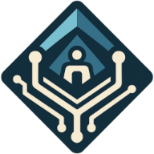

# Circuitscan

> In the same way as we have Etherscan for solidity "Publish Your Source Code" we need to have Etherscan, "Publish Your Circom Code", or even "Publish Your Stark", "Cairo Precode", or whatever the original source language is. And then it would compile and it would actually verify that the on-chain verification key matches. These are things that totally can be done. And I hope someone does them in the hackathon tomorrow.

*Vitalik Buterin March 26, 2024* [Source](https://web.archive.org/web/20240525102411/https://www.defideveloper.news/vitalik-ethtaipei-interview/)

Circuitscan explorer of on-chain circuit verifiers

Circuit developers can use the CLI to compile circuits on a cloud machine with a simple command (with up to 512 GB RAM)

dApp users can check the safety of the application and make proofs as needed

* [Documentation](https://circuitscan.readthedocs.io/)
* [Telegram group](https://t.me/circuitscan)
* [Circuitscan CLI](https://github.com/circuitscan/cli)

## Repository Map

This repository contains the frontend, server (compares on-chain Solidity source against Solidity output by the compilation pipeline along with other administrative functions), and CloudFormation templates necessary for [hosting Circuitscan on AWS](https://circuitscan.readthedocs.io/en/latest/hosting.html).

For issues related to compiling Circom files, see the [circom-pipeline repo](https://github.com/circuitscan/circom-pipeline)

To create new compilation pipelines, see the [circuitscan-pipeline-runner repo](https://github.com/circuitscan/circuitscan-pipeline-runner)

For issues related to the documentation, see the [docs repo](https://github.com/circuitscan/docs)

## Installation

To run the frontend locally:

> [!NOTE]
> Requires Node.js and Yarn

```
$ git clone https://github.com/numtel/circuitscan
$ cd circuitscan
$ yarn

# Default env var settings are fine for using remote deployed server
$ cp .env.example .env

# In another terminal, start frontend dev server
$ yarn dev
```

### Local Server

Optionally, you can also develop the server locally.

> [!NOTE]
> Requires Docker

```
# Configure S3 settings for local server
$ vim .env

# Build server lambda docker image
$ yarn build:server

# Run server lambda in docker container
$ yarn dev:server

# Update .env to VITE_SERVER_URL=/api to use server running in local Docker

# Server tests are run on your local machine
$ cd server/
$ yarn
$ yarn test

```

## Contributions

Contributions to Circuitscan are welcome! Please make an issue or PR.

Special thanks to [Ethereum Foundation Ecosystem Support Program](https://esp.ethereum.foundation/) for supporting phase one of Circuitscan development!

## License

MIT
